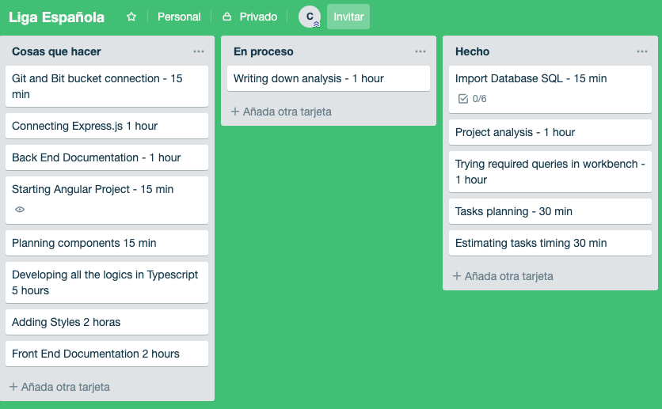

**project analysis and planning **
===

**Analysis**
----
  * **Website content**
  
      * Landing page with a Search bar.
      * Results page with a List of results.

* **How to perform searches:**

There are two imputs. We can type only one team name in one of the inputs, or one team name in EACH one of the inputs, this will bring different types of results: 

  * Two football teams names:
      * List of results:
          * games played
          * results
          * stadium
          * date
          * listed in order by season.    
  * One football team name:
    * List of results:
        * name
        * statistics grouped by season
        * season
        * games played
        * games won
        * games lost
        * games tied
        * goals for
        * goals against
    * Show the results grouped by season and in descending order by date.

**Planning**
--

* **Making use of Trello, a "kanban" online tool, planned the tasks that will take to develop this application and estimated the time it would take for each task.**

**Tasks**
--
* **Import database** - 
    * installing the database in my local instance.
* **Analysis:** 
    * took notes of the requirements, read the database content and tried some queries with "MySQL Workbench".
* **Estimating tasks timing** 
* **Writing down analysis**
* **Git and BitBucket repositories** 
* **Developing Express Server**
* **Back End Documentation** 
* **Starting Angular project**
* **planning components** 
* **Adding Styles** 
* **Front End Documentation**
